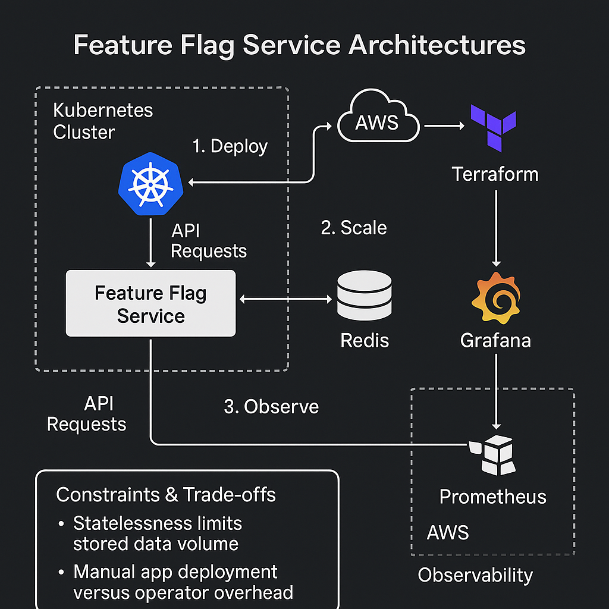

# 🚀 Feature Flag Service (Spring Boot + Docker)

A lightweight platform service to manage feature flags, secured with an API key and containerized with Docker.

---

## 🧠 System Architecture Overview

The Feature Flag Service is built with a scalable and observable platform engineering mindset. Below is a high-level system design diagram illustrating how the service interacts with Kubernetes, Prometheus, Grafana, Terraform, AWS, and CI/CD via GitHub Actions.

### 🌐 Key Components

- **Spring Boot** REST API for managing feature flags stored in **Redis**.
- **Docker** containerized service.
- **Kubernetes (EKS)** for orchestration and self-healing deployments.
- **Terraform** for infrastructure as code (IaC) provisioning on AWS.
- **Prometheus + Grafana** for monitoring and observability.
- **GitHub Actions** for CI/CD pipelines, automating test/build/deploy flows.

This setup ensures high availability, observability, and operational efficiency aligned with modern platform engineering principles.

## ⚖️ Constraints, Tradeoffs, and Opportunities for Improvement

### 🔒 Constraints

- **Stateless API design**  
  Feature flags are stored in Redis with no persistent database, limiting historical audits or flag versioning.

- **No Role-Based Access Control (RBAC)**  
  Only a static API key is used for authentication. No user-level access control exists.

- **Limited validation and error handling**  
  The system assumes ideal client behavior; there's minimal defensive programming for malformed or malicious requests.

- **Single-region AWS deployment**  
  All infrastructure is provisioned in one AWS region, which may impact availability or latency globally.

- **Manual Redis provisioning**  
  Redis is assumed to be pre-provisioned or externally managed, not automated in Terraform for now.

---

### 🔁 Tradeoffs

- **Simplicity vs. Extensibility**  
  Chose a flat REST API and Redis backend for speed and simplicity. This sacrifices support for flag targeting, bucketing, or gradual rollouts.

- **Infrastructure-as-code (Terraform) granularity**  
  Modularizing Terraform for each resource increases reusability, but also adds verbosity and learning curve for new engineers.

- **Prometheus/Grafana stack overhead**  
  Self-managing Prometheus and Grafana adds operational load compared to using managed observability (e.g., Amazon CloudWatch or Grafana Cloud).

- **Docker + Kubernetes overhead**  
  For a lightweight service, Kubernetes adds complexity, but enables scalability and resilience needed for production-readiness.

---

### 🚀 Opportunities for Improvement

- ✅ Add **RBAC and OAuth2 support** for multi-user access and granular control over who can modify flags.
- 🧠 Integrate **flag analytics and event logging** (e.g., to Amazon CloudWatch or ELK stack).
- 🔐 Rotate API keys dynamically or move to **Secrets Manager** for secure credentials.
- 🌍 Introduce **multi-region Redis** or backup failover strategy.
- 📦 Add support for **gradual rollouts** or **flag targeting** using flag metadata and a rule engine.
- ⚙️ Automate Redis and monitoring stack provisioning using **Terraform modules**.
- 💡 Build a **frontend dashboard** to manage feature flags visually.

---

This balanced platform design favors ease of development, fast deployments, and observability while leaving clear paths for scaling, securing, and extending the system.
